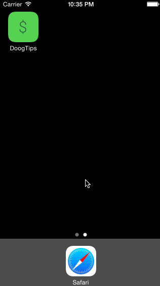

# Codepath Tip Calculator Sample App

### Description:
This is a simple tip calculator that I created as a part of my submission to the CodePath iOS for Designers class. I added some unique styling to the sample app I created as well as created custom assets for the application icon and launch image.

### Time spent:
1.5 hours spent in total

### Completed user stories:
 * [x] Required: User can adjust tip between 18%, 20%, or 22%
 * [x] Optional: Changed the colors and fonts of the views to a match a money-green aesthetic
 * [x] Optional: Added custom font (Roboto)
 * [x] Optional: Added branded app icon and launch image
 * [x] Optional: Added simple animation to fade-in tip and total bill amount
 
### Notes:
I elected to have the keyboard display within viewDidLoad by assigning it as a firstResponder to save the user the additional step of having to provide focus to the bill textField.

### Walkthrough of all user stories:

GIF created with [LiceCap](http://www.cockos.com/licecap/).

